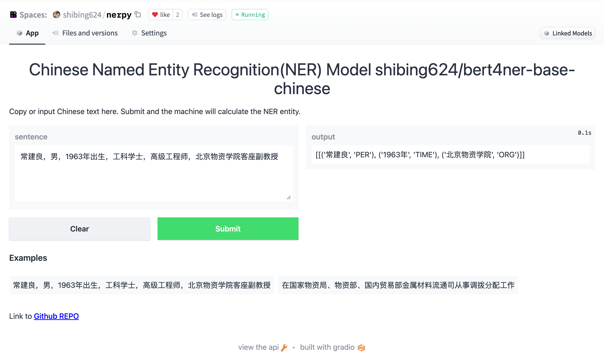

[](https://badge.fury.io/py/nerpy)
[](https://pepy.tech/project/nerpy)
[](CONTRIBUTING.md)
[](https://github.com/shibing624/nerpy/graphs/contributors)
[](LICENSE)
[](requirements.txt)
[](https://github.com/shibing624/nerpy/issues)
[](#Contact)

# NERpy
🌈 Implementation of Named Entity Recognition using Python. 

**nerpy**实现了Bert2Tag、Bert2Span等多种命名实体识别模型，并在标准数据集上比较了各模型的效果。


**Guide**
- [Feature](#Feature)
- [Evaluation](#Evaluation)
- [Install](#install)
- [Usage](#usage)
- [Contact](#Contact)
- [Reference](#reference)


# Feature
### 命名实体识别模型
- [CoSENT(Cosine Sentence)](nerpy/cosent_model.py)：CoSENT模型提出了一种排序的损失函数，使训练过程更贴近预测，模型收敛速度和效果比Sentence-BERT更好，本项目基于PyTorch实现了CoSENT模型的训练和预测

# Evaluation

### 实体识别

- 英文实体识别数据集的评测结果：

| Arch | Backbone | Model Name | English-STS-B | 
| :-- | :--- | :--- | :-: |
| CoSENT | sentence-transformers/bert-base-nli-mean-tokens | CoSENT-base-nli-first_last_avg | 79.68 |

- 中文实体识别数据集的评测结果：

| Arch | Backbone | Model Name | ATEC | BQ | LCQMC | PAWSX | STS-B | Avg | QPS |
| :-- | :--- | :--- | :-: | :-: | :-: | :-: | :-: | :-: | :-: |
| SBERT | hfl/chinese-roberta-wwm-ext | SBERT-roberta-ext | 48.29 | 69.99 | 79.22 | 44.10 | 72.42 | 62.80 | - |

- 本项目release模型的中文匹配评测结果：

| Arch | Backbone | Model Name | ATEC | BQ | LCQMC | PAWSX | STS-B | Avg | QPS |
| :-- | :--- | :---- | :-: | :-: | :-: | :-: | :-: | :-: | :-: |
| Word2Vec | word2vec | w2v-light-tencent-chinese | 20.00 | 31.49 | 59.46 | 2.57 | 55.78 | 33.86 | 10283 |

说明：
- 结果值均使用F1
- 结果均只用该数据集的train训练，在test上评估得到的表现，没用外部数据
- `CoSENT-macbert-base`模型达到同级别参数量SOTA效果，是用CoSENT方法训练，运行[examples/training_sup_text_matching_model.py](examples/training_sup_text_matching_model.py)代码可在各数据集复现结果
- 各预训练模型均可以通过transformers调用，如MacBERT模型：`--model_name hfl/chinese-macbert-base`
- 中文匹配数据集下载[链接见下方](#数据集)
- 中文匹配任务实验表明，pooling最优是`first_last_avg`，即 SentenceModel 的`EncoderType.FIRST_LAST_AVG`，其与`EncoderType.MEAN`的方法在预测效果上差异很小
- QPS的GPU测试环境是Tesla V100，显存32GB

# Demo

Official Demo: http://42.193.145.218/product/short_text_sim/

HuggingFace Demo: https://huggingface.co/spaces/shibing624/nerpy



# Install
```
pip3 install torch # conda install pytorch
pip3 install -U nerpy
```

or

```
git clone https://github.com/shibing624/nerpy.git
cd nerpy
python3 setup.py install
```

### 数据集
中文实体识别数据集已经上传到huggingface datasets [https://huggingface.co/datasets/shibing624/nli_zh](https://huggingface.co/datasets/shibing624/nli_zh)

# Usage

## 实体识别

基于`pretrained model`计算实体识别：

```shell
>>> from nerpy import Bert2Tag
>>> m = Bert2Tag()
>>> m.ner("University of California is located in California, United States")
{'LOCATION': ['California', 'United States'], 'ORGANIZATION': ['University of California']}
```

example: [examples/ner_demo.py](examples/ner_demo.py)

```python
import sys

sys.path.append('..')
from nerpy import Bert2Tag

def compute_ner(model):
    sentences = [
        '北京大学学生来到水立方观看水上芭蕾表演',
        'University of California is located in California, United States'
    ]
    entities = model.ner(sentences)
    print(entities)


if __name__ == "__main__":
    # 中文实体识别模型，支持fine-tune继续训练
    t2v_model = Bert2Tag("shibing624/nerpy-base-chinese")
    compute_ner(t2v_model)

    # 支持多语言的实体识别模型，英文实体识别任务推荐，支持fine-tune继续训练
    sbert_model = Bert2Tag("sentence-transformers/paraphrase-multilingual-MiniLM-L12-v2")
    compute_ner(sbert_model)
```

output:
```
{'LOCATION': ['水立方'], 'ORGANIZATION': ['北京大学']}
{'LOCATION': ['California', 'United States'], 'ORGANIZATION': ['University of California']}
```

- `shibing624/nerpy-base-chinese`模型是CoSENT方法在中文STS-B数据集训练得到的，模型已经上传到huggingface的
模型库[shibing624/nerpy-base-chinese](https://huggingface.co/shibing624/nerpy-base-chinese)，
是`nerpy.SentenceModel`指定的默认模型，可以通过上面示例调用，或者如下所示用[transformers库](https://github.com/huggingface/transformers)调用，
模型自动下载到本机路径：`~/.cache/huggingface/transformers`

#### Usage (HuggingFace Transformers)
Without [nerpy](https://github.com/shibing624/nerpy), you can use the model like this: 

First, you pass your input through the transformer model, then you have to apply the right pooling-operation on-top of the contextualized word embeddings.

example: [examples/use_origin_transformers_demo.py](examples/use_origin_transformers_demo.py)

```python
import os
import torch
from transformers import AutoTokenizer, AutoModel

os.environ["KMP_DUPLICATE_LIB_OK"] = "TRUE"


# Mean Pooling - Take attention mask into account for correct averaging
def mean_pooling(model_output, attention_mask):
    token_embeddings = model_output[0]  # First element of model_output contains all token embeddings
    input_mask_expanded = attention_mask.unsqueeze(-1).expand(token_embeddings.size()).float()
    return torch.sum(token_embeddings * input_mask_expanded, 1) / torch.clamp(input_mask_expanded.sum(1), min=1e-9)


# Load model from HuggingFace Hub
tokenizer = AutoTokenizer.from_pretrained('shibing624/nerpy-base-chinese')
model = AutoModel.from_pretrained('shibing624/nerpy-base-chinese')
sentences = ['北京大学学生来到水立方观看水上芭蕾表演']
# Tokenize sentences
encoded_input = tokenizer(sentences, padding=True, truncation=True, return_tensors='pt')

# Compute token embeddings
with torch.no_grad():
    model_output = model(**encoded_input)
print("Sentence Entities:")
print(model_output)
```


## Bert2Tag model

Sentence-BERT文本匹配模型，表征式句向量表示方案

Network structure:

Training:


Inference:


#### Bert2Tag 监督模型
- 在中文STS-B数据集训练和评估`MacBERT+Bert2Tag`模型

example: [examples/training_sup_text_matching_model.py](examples/training_sup_text_matching_model.py)

```shell
cd examples
python3 training_sup_text_matching_model.py --model_arch sentencebert --do_train --do_predict --num_epochs 10 --model_name hfl/chinese-macbert-base --output_dir ./outputs/STS-B-sbert
```
- 在英文STS-B数据集训练和评估`BERT+SBERT`模型

example: [examples/training_sup_text_matching_model_en.py](examples/training_sup_text_matching_model_en.py)

```shell
cd examples
python3 training_sup_text_matching_model_en.py --model_arch sentencebert --do_train --do_predict --num_epochs 10 --model_name bert-base-uncased --output_dir ./outputs/STS-B-en-sbert
```


# Contact

- Issue(建议)：[](https://github.com/shibing624/nerpy/issues)
- 邮件我：xuming: xuming624@qq.com
- 微信我：
加我*微信号：xuming624, 备注：姓名-公司-NLP* 进NLP交流群。


# Citation

如果你在研究中使用了nerpy，请按如下格式引用：

APA:
```latex
Xu, M. nerpy: Text to vector toolkit (Version 0.0.2) [Computer software]. https://github.com/shibing624/nerpy
```

BibTeX:
```latex
@software{Xu_nerpy_Text_to,
author = {Xu, Ming},
title = {{nerpy: Named Entity Recognition Toolkit}},
url = {https://github.com/shibing624/nerpy},
version = {0.0.2}
}
```

# License


授权协议为 [The Apache License 2.0](LICENSE)，可免费用做商业用途。请在产品说明中附加nerpy的链接和授权协议。


# Contribute
项目代码还很粗糙，如果大家对代码有所改进，欢迎提交回本项目，在提交之前，注意以下两点：

 - 在`tests`添加相应的单元测试
 - 使用`python setup.py test`来运行所有单元测试，确保所有单测都是通过的

之后即可提交PR。

# Reference
- [transformers](https://github.com/huggingface/transformers)
